<picture>
  <source media="(prefers-color-scheme: dark)" srcset="./assets/hero-dark.png" />
  <source media="(prefers-color-scheme: light)" srcset="./assets/hero-light.png" />
  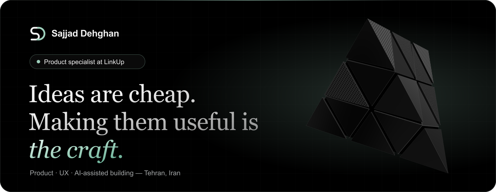
</picture>

  
  
  

I'm a product specialist with a computer engineering degree. I figure out what's worth building, sketch it, ship a small version, and watch whether people actually use it.

**Right now** I'm building [LinkUp](https://app.welinkup.org/), a bilingual marketplace for Iranian talent and clients abroad. The hardest parts are trust and payments: I work on AI help for writing proposals, the shared workspace where freelancers and clients get things done, and escrow and wallet flows.

 

### How I work

<picture>
  <source media="(prefers-color-scheme: dark)" srcset="./assets/loop-dark.png" />
  <source media="(prefers-color-scheme: light)" srcset="./assets/loop-light.png" />
  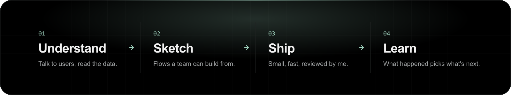
</picture>

 

### Products

<table>
  <tr>
    <td align="center" width="20%"><a href="https://github.com/sedwna/open-product-operations-os">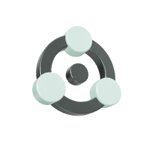 <b>Open Product Operations OS</b></a> Agents, workbooks and QA checks from idea to release</td>
    <td align="center" width="20%">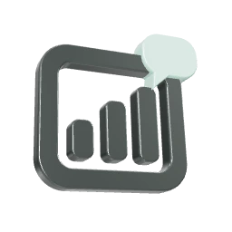 <b>ProductDashboard</b> Persian desktop app where a PM works through chat <code>private</code></td>
    <td align="center" width="20%">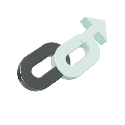 <b>LinkUp Product</b> Readiness, QA evidence and journeys, run by 13 agents <code>private</code></td>
    <td align="center" width="20%">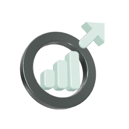 <b>LinkVest Product</b> Milestone-based investment for digital products <code>private</code></td>
    <td align="center" width="20%">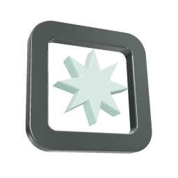 <b>BoomRoom</b> Curated marketplace for Persian contemporary art <code>private</code></td>
  </tr>
</table>

### Tools and apps

<table>
  <tr>
    <td align="center" width="20%"><a href="https://github.com/sedwna/Ticket-reservation">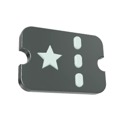 <b>Ticket Reservation</b></a> Live seat map for a university amphitheater</td>
    <td align="center" width="20%"><a href="https://github.com/sedwna/basu-rental">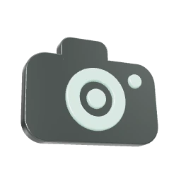 <b>BASU Rental</b></a> Equipment booking with a Jalali calendar</td>
    <td align="center" width="20%"><a href="https://t.me/AIRadarFa">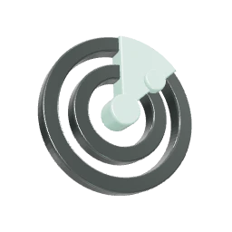 <b>AI Radar</b></a> Serverless Persian AI news for Telegram</td>
    <td align="center" width="20%">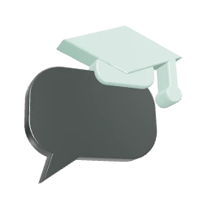 <b>Dars Ba Ki Bardaram</b> Telegram bot for professor reviews <code>private</code></td>
    <td align="center" width="20%"><a href="https://github.com/sedwna/DonkeyNet">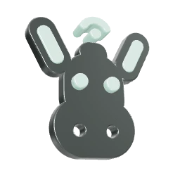 <b>DonkeyNet</b></a> A funny Windows tray app that watches your internet</td>
  </tr>
  <tr>
    <td align="center" width="20%"><a href="https://github.com/sepehrbayat/sandwich-download-manager">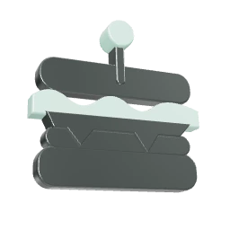 <b>Sandwich DM</b></a> Open-source download manager; I added scheduling and signed releases</td>
    <td align="center" width="20%"><a href="https://github.com/sedwna/giraffe-login-experience">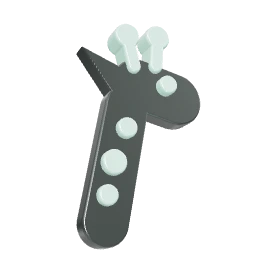 <b>Giraffe Login</b></a> A login screen with a giraffe that looks away</td>
    <td align="center" width="20%"><a href="https://github.com/sedwna/BAXI">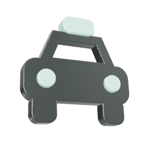 <b>BAXI</b></a> Ride and freight app prototype in PyQt</td>
    <td align="center" width="20%"><a href="https://github.com/sedwna/sso-case-portal-api">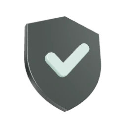 <b>SSO Case Portal</b></a> Django REST API with OTP login</td>
    <td align="center" width="20%"><a href="https://github.com/sedwna/province-road-network-dijkstra">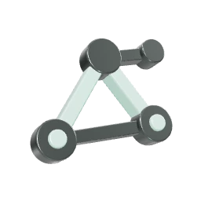 <b>Province Roads</b></a> Cheapest routes with Dijkstra, in C++</td>
  </tr>
</table>

### Games

<table>
  <tr>
    <td align="center" width="25%"><a href="https://github.com/sedwna/dino-dash">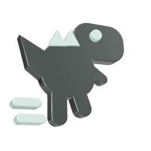 <b>Dino Dash</b></a> Endless runner, no build step, 114 tests</td>
    <td align="center" width="25%"><a href="https://github.com/sedwna/Tic-Tac-Py">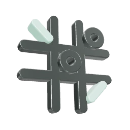 <b>Tic-Tac-Py</b></a> Terminal tic-tac-toe with a computer opponent</td>
    <td align="center" width="25%"><a href="https://github.com/sedwna/Four-In-A-Row-Game">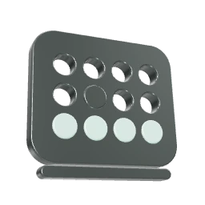 <b>Four In A Row</b></a> Connect Four in C, with replayable saves</td>
    <td align="center" width="25%"><a href="https://github.com/sedwna/Hungry-Snake-Adventure">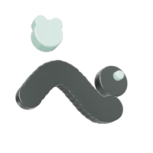 <b>Hungry Snake</b></a> C++ and SFML snake that hunts frogs</td>
  </tr>
</table>

### AI and data

<table>
  <tr>
    <td align="center" width="25%"><a href="https://github.com/sedwna/ChatterAI"> <b>ChatterAI</b></a> Persian intent chatbot, BoW and LSTM</td>
    <td align="center" width="25%"><a href="https://github.com/sedwna/Image2Text-Translate">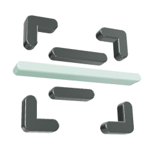 <b>Image2Text</b></a> OCR, then translation to Persian</td>
    <td align="center" width="25%"><a href="https://github.com/sedwna/congressional-voting-analysis">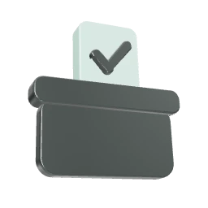 <b>Voting Analysis</b></a> Association rules and a decision tree</td>
    <td align="center" width="25%"><a href="https://github.com/sedwna/obesity-level-prediction">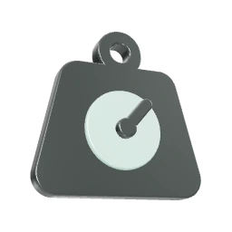 <b>Obesity Levels</b></a> Random forest at about 95% accuracy</td>
  </tr>
  <tr>
    <td align="center" width="25%"><a href="https://github.com/sedwna/mobile-price-classification">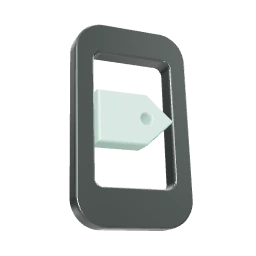 <b>Mobile Prices</b></a> Four classifiers compared; SVM wins</td>
    <td align="center" width="25%"><a href="https://github.com/sedwna/noise-type-classification">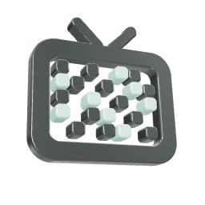 <b>Noise Types</b></a> Which noise is in the image, from its histogram</td>
    <td align="center" width="25%"><a href="https://github.com/sedwna/salary-linear-regression-pytorch">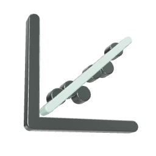 <b>Salary Regression</b></a> Linear regression by hand in PyTorch</td>
    <td width="25%"></td>
  </tr>
</table>

 

### Background

- **Product specialist**, LinkUp — Apr 2025 to now
- **B.Sc. Computer Engineering**, Bu-Ali Sina University — 2021 to 2025
- **Secretary and chair-level roles**, Computer Engineering Scientific Association — helped run 100+ academic and cultural events
- **Head TA** for AI, Data Structures and Basic Programming
- **20th** at ICPC Asia Regional, Tehran 2024

**Certificates:** Product Management Bootcamp (Diginext Academy) · Design Thinking and Product Discovery (Hamrah Academy) · [Scrum Mastery (FaraDars)](https://faradars.org/verify/0095AD26)

### Toolbox

  
  
  
  
  
  
   
  
  
  
  
  
  
  

### Activity

<picture>
  <source media="(prefers-color-scheme: dark)" srcset="https://raw.githubusercontent.com/sedwna/sedwna/output/github-activity-snake-dark.svg?v=mint" />
  <source media="(prefers-color-scheme: light)" srcset="https://raw.githubusercontent.com/sedwna/sedwna/output/github-activity-snake.svg?v=mint" />
  
</picture>

Each square is a real day of activity. Private contributions are counted but their details stay private.

  

<a href="mailto:sajaddehqan2002@gmail.com">
  <picture>
    <source media="(prefers-color-scheme: dark)" srcset="./assets/closing-dark.png" />
    <source media="(prefers-color-scheme: light)" srcset="./assets/closing-light.png" />
    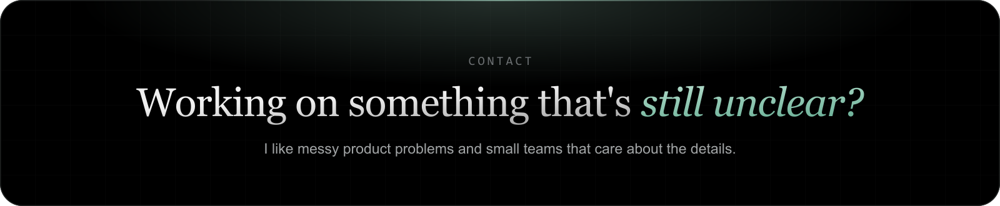
  </picture>
</a>
